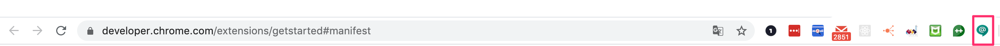
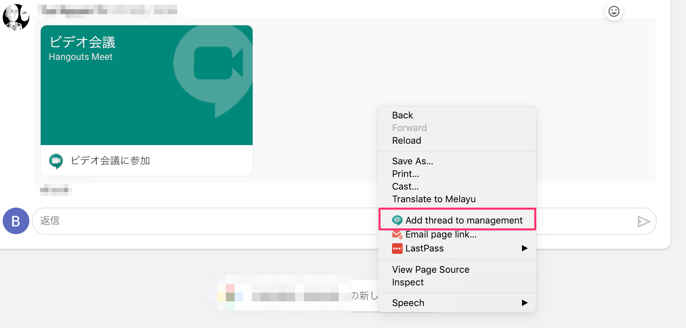
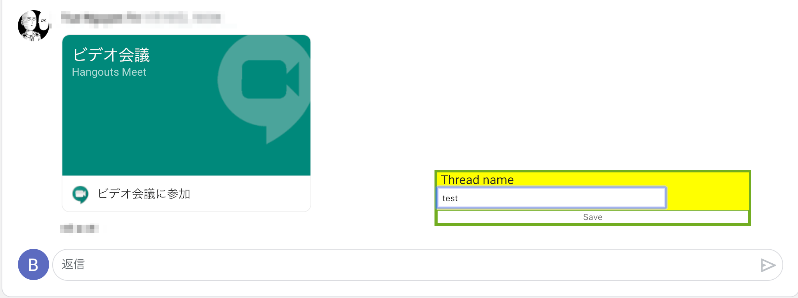
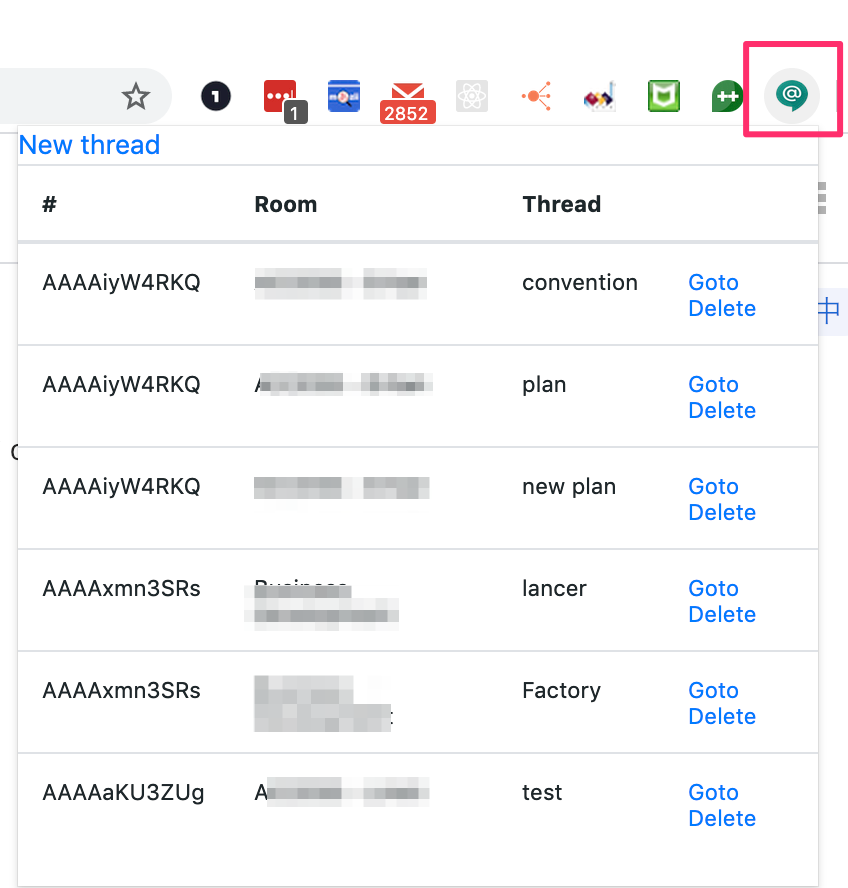
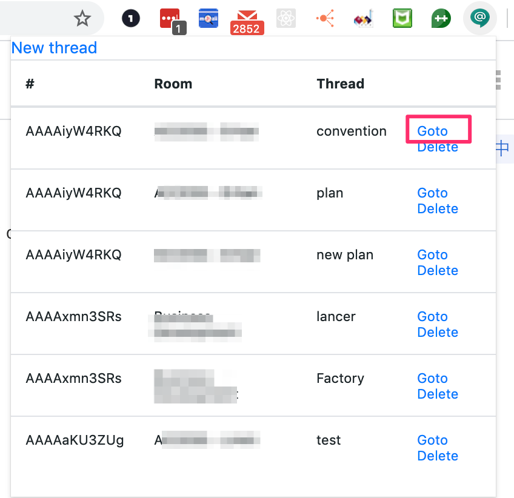
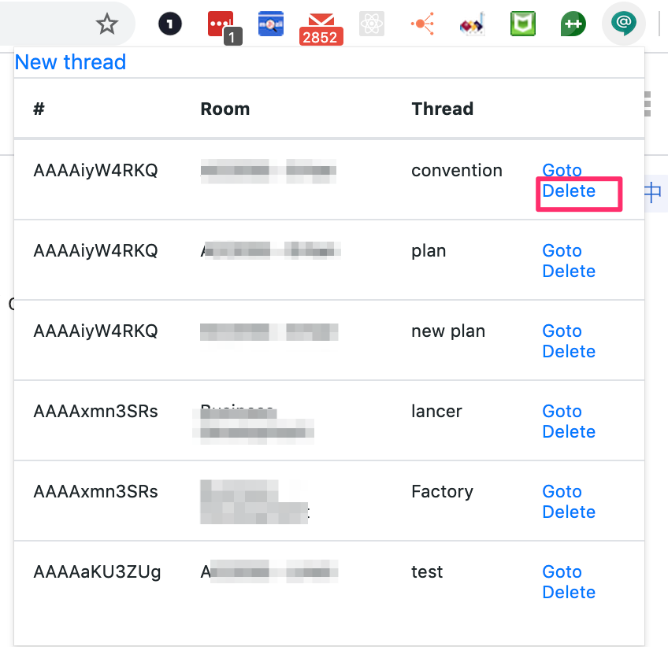

# README
- This is a chrome extension that support managment threads of Google hangout chat.

### Setup

- Clone source code `google-hangout-threads-managment` of my repository.

```
mkdir ~/Documents/chrome_extensions
cd ~/Documents/chrome_extensions
git clone git@bitbucket.org:buiminhthuk55/google-hangout-threads-management.git
```

- Read [this tutorial] to import `google-hangout-threads-management` to chrome.

- If your chrome has icon `@`, the extension is imported successfully.



### How to use
##### 1. Add new thread to management board

- Hover to thread and right click
- Click to `Add thread to management`



- Input thread name and click 「Save」



##### 2. List all threads what are managed



##### 3. Go to thread



- If that thread belongs to current room → click 1 time
- If that thread belongs to other room → click 1 time then more 1 time after page is reload.

##### 4. Delete thread from management


